# Amazon 2023 Products Analysis


The interactive dashboard can be filtered based on any choosing of stars, reviews and price of products and automatically displays the corresponding statistics.
[Click here to open the live dashboard in Tableau Public](https://public.tableau.com/app/profile/ren.dar/viz/Amazon2023ProductsCanada_17439324460890/Dashboard1?publish=yes)

## Introduction

This report is divided into five main topics:

1.  **Sales and Total Revenue Analysis** – Examines the total revenue
    generated (by category) and key sales patterns.

2.  **Effect of Discounts on Units Sold** – Use regression techniques to
    find correlations between a category’s units sold and discount
    percentages.

3.  **Performance of Products (Top 10 Categories)** - Identify the
    amount of high-selling and low-selling products and find key
    differences between them (ratings, prices, reviews).

4.  **Keyword Analysis** - Use text mining to analyze the most used
    words.

5.  **Code Appendix** – Contains the full R code used in this analysis.

The data set consists of 2.1 million Amazon products available in
Canada. It was retrieved from Kaggle: [Amazon Canada Products 2023 -
2.1M](https://www.kaggle.com/datasets/asaniczka/amazon-canada-products-2023-2-1m-products/data).
We will apply statistical regression and other methods to examine
possible correlations between various variables. First, let us reveal a
summary of the data set.

    Rows: 2165926 Columns: 11
    ── Column specification ────────────────────────────────────────────────────────
    Delimiter: ","
    chr (5): asin, title, imgUrl, productURL, categoryName
    dbl (5): stars, reviews, price, listPrice, boughtInLastMonth
    lgl (1): isBestSeller

    ℹ Use `spec()` to retrieve the full column specification for this data.
    ℹ Specify the column types or set `show_col_types = FALSE` to quiet this message.

         asin              title              imgUrl           productURL       
     Length:2165926     Length:2165926     Length:2165926     Length:2165926    
     Class :character   Class :character   Class :character   Class :character  
     Mode  :character   Mode  :character   Mode  :character   Mode  :character  
                                                                                
                                                                                
                                                                                
         stars          reviews             price            listPrice       
     Min.   :0.000   Min.   :     0.0   Min.   :    0.00   Min.   :   0.000  
     1st Qu.:0.000   1st Qu.:     0.0   1st Qu.:   15.42   1st Qu.:   0.000  
     Median :4.000   Median :     5.0   Median :   27.42   Median :   0.000  
     Mean   :2.624   Mean   :   545.7   Mean   :  111.22   Mean   :   4.651  
     3rd Qu.:4.500   3rd Qu.:   123.0   3rd Qu.:   57.50   3rd Qu.:   0.000  
     Max.   :5.000   Max.   :868865.0   Max.   :40900.00   Max.   : 999.990  
     categoryName        isBestSeller      boughtInLastMonth  
     Length:2165926     Min.   :0.000000   Min.   :    0.000  
     Class :character   1st Qu.:0.000000   1st Qu.:    0.000  
     Mode  :character   Median :0.000000   Median :    0.000  
                        Mean   :0.003534   Mean   :    9.005  
                        3rd Qu.:0.000000   3rd Qu.:    0.000  
                        Max.   :1.000000   Max.   :20000.000  

There are a total of 2165926 rows and 11 columns: asin (unique code for
each product), title, imgUrl, productURL, stars, reviews, price, list
price, categoryName, isBestSeller and boughtInLastMonth (amount of units
bought on the month).

## Category-Wise Sales and Revenue

An important metric to consider in our sales analysis is the
categorization of products. In this case, there are a 266 labelled
categories that we can evaluate. Let’s see each category’s generated
revenue and amount of bestsellers they have.

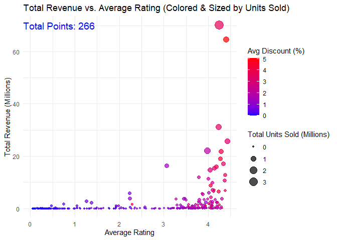

We see from the graph that a rating below 2 rarely have discounts and
that their total revenue is much smaller relative to products with
ratings above 2. Additionally, we can visually see that most points
(categories) with a higher average discount, falls on a higher rating
and have more revenue than points with little to no discount.

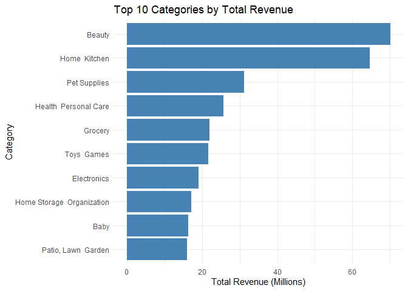

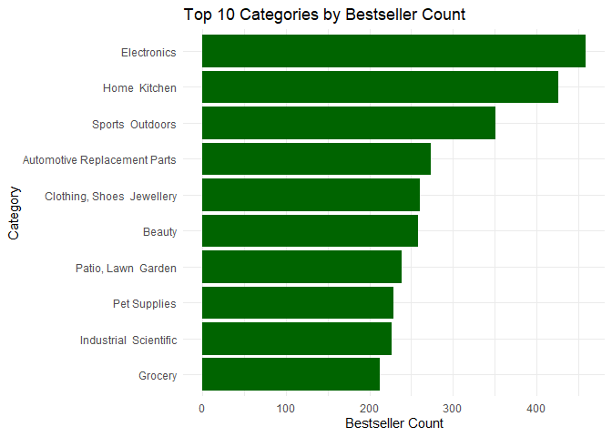

Beauty and home kitchen are two leading categories that generated over
60 million CAD in the month which compared to the 3rd leading category,
pet supplies, only generated about 30 million CAD that month. However,
when we see the chart for most bestsellers, beauty section ranked 6th
while pet supplies ranked 8th without significant difference. Home
kitchen retains its 2nd rank with over 100 products more than sports
outdoors (3rd). Despite electronics being 7th in generating revenue, it
ranked 1st for bestseller counts. These findings suggest that categories
such as beauty, pet supplies or even groceries have more total sales
while categories such as electronics have more average sales directed
towards a single product. This is because it is known that Amazon’s best
seller status is determined by a products sales volumes over a period of
time.

## Effect of Discounts on Units Sold

Our findings above show us that there is a certain (possible)
relationship between discounted products and their sales volume. Let us
further analyze each category using linear regression to see if there is
a correlation between the two. Firstly, as our data for total units sold
by category is highly skewed, we shall apply a log transformation to
reduce heteroscedasticity. The response variable for our model will be
the total log units sold (in a category) and the predictor variable will
be the average discount.


    Call:
    lm(formula = log_units_sold ~ avg_discount, data = category_sales)

    Residuals:
        Min      1Q  Median      3Q     Max 
    -7.7278 -1.9750  0.2556  1.9502  7.0668 

    Coefficients:
                 Estimate Std. Error t value Pr(>|t|)    
    (Intercept)    3.9072     0.2846   13.73   <2e-16 ***
    avg_discount   2.4816     0.1623   15.29   <2e-16 ***
    ---
    Signif. codes:  0 '***' 0.001 '**' 0.01 '*' 0.05 '.' 0.1 ' ' 1

    Residual standard error: 2.993 on 264 degrees of freedom
    Multiple R-squared:  0.4697,    Adjusted R-squared:  0.4677 
    F-statistic: 233.9 on 1 and 264 DF,  p-value: < 2.2e-16

    `geom_smooth()` using formula = 'y ~ x'

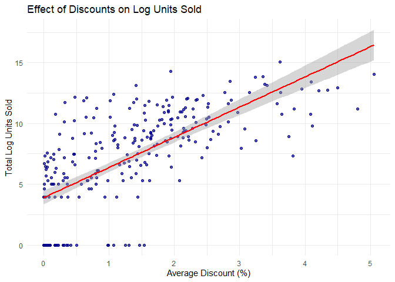

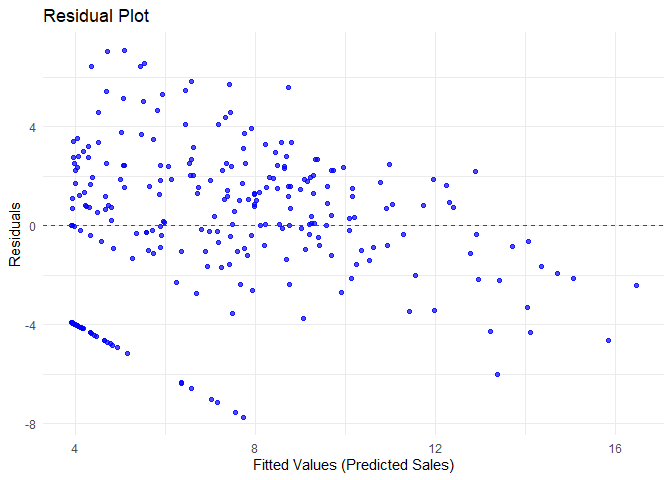

The model is a linear regression with intercept = 3.9072 and slope =
2.4816. Thus, the expected units sold for a category without
implementing any discount is $e^{3.9072} = 49.8$ and a 1% increase in
discount will approximately increase the total units sold by
$e^{2.4816} = 11.95$. Additionally, we see that the model explains ~47%
of sales variation by the associated $r^2$. However, the residual vs
fitted plot has a slight curvature so let us re-attempt using a
quadratic regression.


    Call:
    lm(formula = log_units_sold ~ avg_discount + I(avg_discount^2), 
        data = category_sales)

    Residuals:
        Min      1Q  Median      3Q     Max 
    -8.5353 -1.8927  0.3072  1.6883  7.4259 

    Coefficients:
                      Estimate Std. Error t value Pr(>|t|)    
    (Intercept)         2.9177     0.3332   8.757 2.50e-16 ***
    avg_discount        4.5243     0.4268  10.600  < 2e-16 ***
    I(avg_discount^2)  -0.5687     0.1107  -5.137 5.45e-07 ***
    ---
    Signif. codes:  0 '***' 0.001 '**' 0.01 '*' 0.05 '.' 0.1 ' ' 1

    Residual standard error: 2.858 on 263 degrees of freedom
    Multiple R-squared:  0.5181,    Adjusted R-squared:  0.5144 
    F-statistic: 141.4 on 2 and 263 DF,  p-value: < 2.2e-16

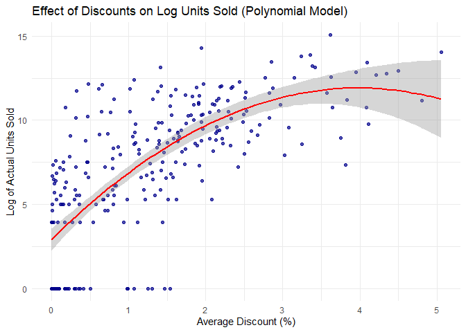

The quadratic model has an intercept of 2.9177, the average discount
being 4.5243 and a quadratic term of -0.5687. Hence, when there is no
discount, the expected units sold will be $e^{2.9177} = 18.5$ and a 1%
increase in discount will approximately increase the total units sold by
$e^{4.5243} = 92.23$. However, the negative quadratic term indicates
that sales growth slows down as discounts increase and eventually
declines. Here, the optimal discount percentage is at
$4.5243/{2\times0.5687}=3.98$%. It has an $r^{2}$ value of 0.5144, which
explains about 51% of variability. This means it is a better fit than
our linear model, so lastly, let us test the necessary assumptions of
our model.

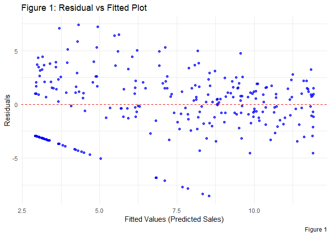

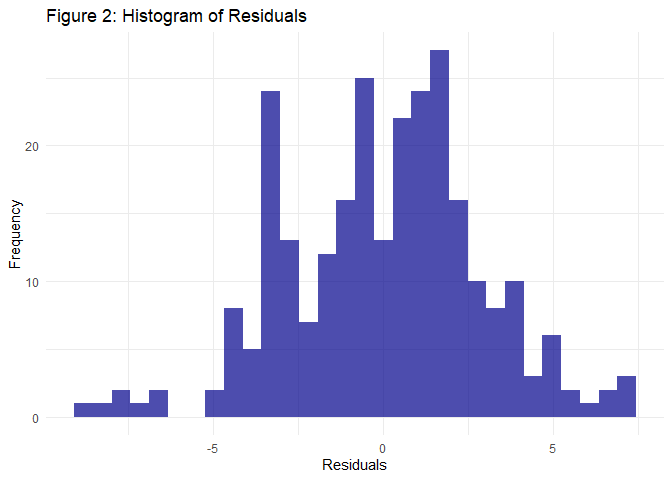

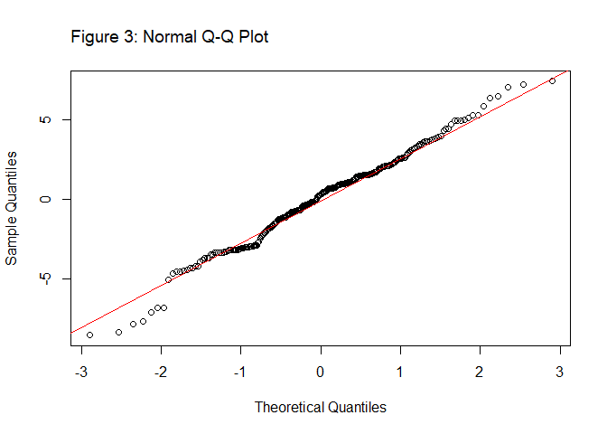

We confirm from figure 2 that the residuals are centered around 0 and it
has a close symmetric distribution. However, there are multiple peaks
meaning that different categories may be behaving differently (perhaps
different intensity in popularity). Additionally, figure 3 shows that
residuals are normally distributed since it falls on the red line and
that there are no deviations in the middle. From figure 1, we can see
that the residuals are spread randomly, around 0 line and that there are
no funnel-shaped pattern, confirming homoscedasticity. We can conclude
that the relationship between discount and log units sold follows more
reliably, a quadratic curve from the fitted model. We note that the data
may be affected by the fact that one category may just be less popular
to the general public than another despite having more/less discount.

## Performance of Products (Top 10 Categories)

Let us analyze all the products belonging to the top 10 categories (in
terms of the total units sold). The products without any sales will be
excluded since we only want products that have been bought, to be able
to classify them. We shall classify products that are on the 80th
percentile (total units sold) as high-performing, products that are on
the 20th percentile as low-performing and anything in-between as
mid-performing.

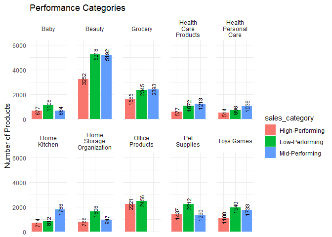

There are a total of 48572 products that have at least 1 sale last month
across all 10 categories. Among those 48572, 12853 are high-performing,
19465 are low-performing and 16254 are mid-performing. Based on the plot
above, we see that all categories have more low-performing products than
high-performing products. Specifically, by an average difference of
661.2 products across all 10 categories. Additionally, we note that
office products have no mid-performing products, meaning the products
are heavily skewed on both sides such that they are all within the 80th
or 20th percentile.

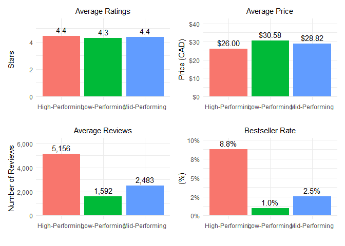

The basic statistics of products are shown on the plot above.
High-performing products have an average of 4.4 stars, similar to
mid-performing products while low-performing products average 4.3 stars.
Despite similar ratings, high-performing products have an average of
2673 reviews more than mid-performing products and 3564 reviews more
than low-performing products. Additionally, we see that high-performing
products tend to be cheaper than both low-performing and mid-performing
products, by a difference of 4 and 2.82 dollars respectively.

## Keyword Analysis

Performing text mining in this data set allows us to be able to Let us
do analyze each keywords associated with each successful and
unsuccessful products to shed some light if certain words are favorable.
Firstly, lets dissect the most common words in best selling products.

| Word    | Count | Categories |
|:--------|------:|-----------:|
| pack    |   914 |        118 |
| black   |   906 |        116 |
| set     |   735 |        104 |
| inch    |   654 |        100 |
| kit     |   537 |         74 |
| women   |   533 |         71 |
| kids    |   499 |         62 |
| bag     |   417 |         63 |
| white   |   404 |         68 |
| outdoor |   389 |         72 |

Top 10 Most Common Words in Bestsellers

| Word    |  Count | Categories |
|:--------|-------:|-----------:|
| black   | 205295 |        266 |
| pack    | 173171 |        264 |
| women   | 161745 |        247 |
| set     | 150436 |        263 |
| outdoor | 139504 |        259 |
| inch    | 134722 |        261 |
| kids    | 132732 |        255 |
| bag     | 130739 |        259 |
| cover   | 113403 |        261 |
| steel   | 109513 |        256 |

Top 10 Most Common Words in Non-Bestsellers

The 2 most popular words for best selling products are pack and black,
with 914 occurrences and 906 occurrences respectively. These two words
appear in over 118 and 116 categories. Interestingly enough for non best
selling products, the top 2 most appearing words are also pack and black
with black being first. There are a total of 205295 occurrences of black
and 173171 occurrences of pack with 266 categories (all categories have
at least one product with ‘black’ in their title) and 264 categories
having those words respectively. Let us now see the most popular words
belonging to the top 6 categories (by total units sold).

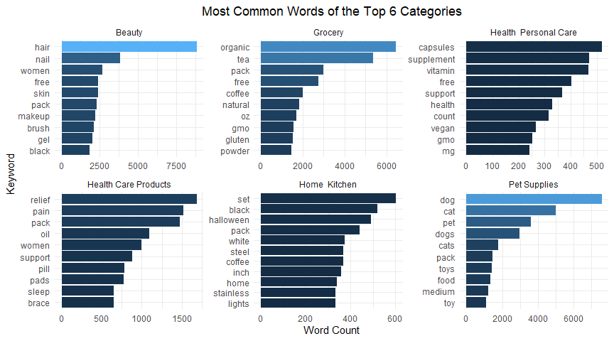

Here, we see that the beauty category has a significant difference
between the word hair and other words, implying that most products (by a
lot) in the beauty category is related to hair. Similarly, pet supplies
and grocery have 2 leading words that differ significantly from other
words. Dog and cat products seems to be the most abundant product in pet
supplies and groceries seem to have more products containing the
keywords organic and tea. The other 3 products have a roughly fair
distribution of words without a single keyword being extensively more
prevalent than others. Below is the graph showing which word is
associated with the most revenue. As expected, the two plots are roughly
similar since more products associated with a keyword means more revenue
for that keyword.

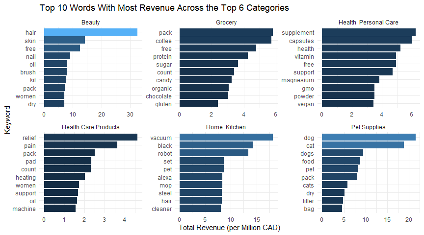

Let us now continue to take a look at the keywords in the high, low and
mid performing products. Instead of word count, we shall use the
term-frequency–inverse-document-frequency (tfidf), which weigh words
based how often the word is distributed in our performance categories
and how rare the word is across all 6 categories. Hence, black which is
frequent in all categories will have a low (tfidf) and say, wireless
which is only frequent in electronics but distributed equally among all
high, mid and low performance categories, will also have a low tfidf.

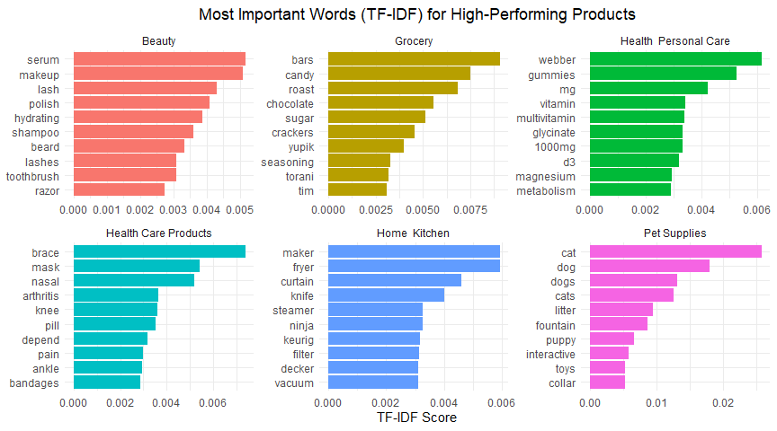

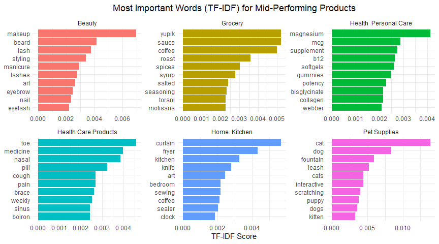

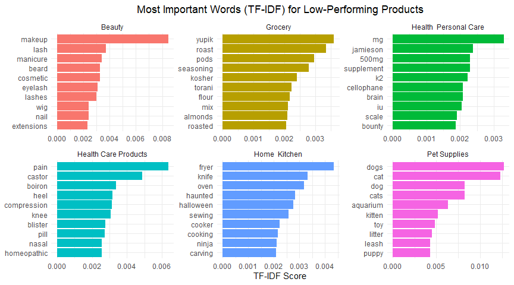

In high-performing products, the word with the most tfidf indicates that
the product containing such a word generate the most revenue. For
example, in high performing products for beauty, we see serum that has
the greatest tfidf which indicates that a large portion of
high-Performing products contain this word in their titles. It is
particularly clear in this example since serum does not appear in the
tfidf plot for mid and low performing products, meaning it is distinctly
high performing. On the other hand, words such as yupik, which ranks
first in both mid and low performing but not as high in high performing
means that word is associated with lower-performing products. Lastly, a
word that is prevalent on all 3 performance levels just means that such
word is heavily associated with the category and has a vast distribution
of products that sells low to high. An example of this is ‘cat’ and
‘dog’ in the pet supplies category.

## Code Appendix

**Reading Data:**

``` r
amazon_data <- read_csv("amz_ca_total_products_data_processed.csv")
amazon_data$isBestSeller <- as.numeric(as.logical(amazon_data$isBestSeller))
summary(amazon_data)
```

**Category-Wise Sales and Revenue:**

``` r
# category dataset
category_sales <- amazon_data %>%
  mutate(revenue = boughtInLastMonth * price, discount = ifelse(listPrice > 0, (listPrice- price) / listPrice * 100, 0)) %>%  group_by(categoryName) %>%
  summarise(
    total_revenue = sum(revenue, na.rm = TRUE),
    avg_rating = mean(stars, na.rm = TRUE),
    avg_discount = mean(discount, na.rm = TRUE),
    bestseller_count = sum(isBestSeller, na.rm = TRUE),
    total_units_sold = sum(boughtInLastMonth, na.rm = TRUE)
  ) %>% arrange(desc(total_revenue))

# revenue vs rating plot
ggplot(category_sales, aes(x = avg_rating, y = total_revenue / 1e6, 
                           color = avg_discount, size = total_units_sold / 1e6)) +
  geom_point(alpha = 0.7) +
  scale_color_gradient(low = "blue", high = "red", name = "Avg Discount (%)") +  
  scale_size_continuous(name = "Total Units Sold (Millions)") +  
  labs(title = "Total Revenue vs. Average Rating (Colored & Sized by Units Sold)",
       x = "Average Rating",
       y = "Total Revenue (Millions)") +
  ggplot2::annotate("text", 
          x = min(category_sales$avg_rating, na.rm = TRUE), 
          y = max(category_sales$total_revenue, na.rm = TRUE) / 1e6, 
          label = paste("                     Total Points:", nrow(category_sales)), 
          size = 5, color = "blue") +
  theme_minimal()
```

``` r
# top revenues bar plot
ggplot(category_sales %>% head(10), aes(x = reorder(categoryName, total_revenue), y = total_revenue / 1e6)) + 
geom_bar(stat = "identity", fill = "steelblue") + coord_flip() +
scale_y_continuous(labels = scales::comma) +  
labs(title = "Top 10 Categories by Total Revenue", x = "Category", 
y = "Total Revenue (Millions)") +  
theme_minimal()

# top bestsellers bar plot
ggplot(category_sales %>% arrange(desc(bestseller_count)) %>% head(10), 
aes(x = reorder(categoryName, bestseller_count), y = bestseller_count)) +
geom_bar(stat = "identity", fill = "darkgreen") + coord_flip() +
labs(title = "Top 10 Categories by Bestseller Count", x = "Category", y = "Bestseller Count") +
theme_minimal()
```

**Effect of Discounts on Units Sold:**

``` r
#linear regression
category_sales$log_units_sold <- log1p(category_sales$total_units_sold)  
log_model <- lm(log_units_sold ~ avg_discount, data = category_sales)
summary(log_model)

ggplot(category_sales, aes(x = avg_discount, y = log_units_sold)) +
  geom_point(alpha = 0.7, color = "darkblue") +
  geom_smooth(method = "lm", color = "red", se = TRUE) +  # Linear trend line
  labs(title = "Effect of Discounts on Log Units Sold",
       x = "Average Discount (%)",
       y = "Total Log Units Sold") +
  theme_minimal()

#residual vs fitted
category_sales$residuals <- resid(log_model)
category_sales$fitted <- fitted(log_model)
ggplot(category_sales, aes(x = fitted, y = residuals)) +
  geom_point(alpha = 0.7, color = "blue") +
  geom_hline(yintercept = 0, linetype = "dashed", color = "red") +
  labs(title = "Residual Plot",
       x = "Fitted Values (Predicted Sales)",
       y = "Residuals") +
  theme_minimal()
```

``` r
log_model_poly <- lm(log_units_sold ~ avg_discount + I(avg_discount^2), data = category_sales)
summary(log_model_poly)

#plot
ggplot(category_sales, aes(x = avg_discount, y = log_units_sold)) +
geom_point(alpha = 0.7, color = "darkblue") +
geom_smooth(method = "lm", formula = y ~ poly(x, 2), color = "red", se = TRUE) +  
labs(title = "Effect of Discounts on Log Units Sold (Polynomial Model)", x = "Average Discount (%)", y = "Log of Actual Units Sold") + theme_minimal()
```

``` r
category_sales$residuals <- resid(log_model_poly)
category_sales$fitted <- fitted(log_model_poly)

# residuals vs. fitted plot
ggplot(category_sales, aes(x = fitted, y = residuals)) + geom_point(alpha = 0.7, color = "blue") +
  geom_hline(yintercept = 0, linetype = "dashed", color = "red") +
  labs(title = "Figure 1: Residual vs Fitted Plot", x = "Fitted Values (Predicted Sales)",
  y = "Residuals", caption = "Figure 1") + theme_minimal()

# histogram residuals
ggplot(category_sales, aes(x = residuals)) + geom_histogram(bins = 30, fill = "darkblue", alpha = 0.7) + 
  labs(title = "Figure 2: Histogram of Residuals", x = "Residuals", y = "Frequency") + theme_minimal()

# qq plot
qqnorm(category_sales$residuals, main = "")
title("Figure 3: Normal Q-Q Plot", adj = 0, font.main = 1)
qqline(category_sales$residuals, col = "red")  
```

**Performance of Products (Top 10 Categories):**

``` r
top_categories <- amazon_data %>%
  group_by(categoryName) %>%
  summarise(total_units_sold = sum(boughtInLastMonth, na.rm = TRUE)) %>%
  arrange(desc(total_units_sold)) %>%
  head(10)

filtered_data <- amazon_data %>%
  filter(categoryName %in% top_categories$categoryName & boughtInLastMonth > 0)

#high vs low performing subset
filtered_data <- filtered_data %>% group_by(categoryName) %>%
  mutate(
    high_sales_threshold = quantile(boughtInLastMonth, 0.80, na.rm = TRUE),
    low_sales_threshold = quantile(boughtInLastMonth, 0.20, na.rm = TRUE), 
    sales_category = case_when(
      boughtInLastMonth >= high_sales_threshold ~ "High-Performing",
      boughtInLastMonth <= low_sales_threshold ~ "Low-Performing",
      TRUE ~ "Mid-Performing"
    )) %>% ungroup()

#high/mid/low summaries
summary_stats <- filtered_data %>%
  group_by(categoryName, sales_category) %>%
  summarise(
    avg_rating = mean(stars, na.rm = TRUE),
    avg_reviews = mean(reviews, na.rm = TRUE),
    avg_price = mean(price, na.rm = TRUE),
    bestseller_rate = mean(isBestSeller, na.rm = TRUE),
    product_count = n(),
    .groups = 'drop'
  )

summary_stats$categoryName <- str_wrap(summary_stats$categoryName, width = 10)
ggplot(summary_stats, aes(x = sales_category, y = product_count, fill = sales_category)) +
  geom_bar(stat = "identity") + geom_text(aes(label = product_count), vjust = 0.5, size = 3, angle = 90) +
  facet_wrap(~categoryName, ncol = 5) +  theme_minimal() +
  labs(title = "Performance Categories", y = "Number of Products", x = NULL) +  
  theme(axis.text.x = element_blank(), axis.ticks.x = element_blank(),
    panel.spacing = unit(1, "lines")) + scale_y_continuous(expand = expansion(mult = c(0.0, 0.225)))
```

``` r
summary_plot <- filtered_data %>%
  group_by(sales_category) %>%
  summarise(
    avg_rating = mean(stars, na.rm = TRUE),
    avg_reviews = mean(reviews, na.rm = TRUE),
    avg_price = mean(price, na.rm = TRUE),
    bestseller_rate = mean(isBestSeller, na.rm = TRUE),
    .groups = 'drop'
  )

#plot the summary 3 barcharts
p1 <- ggplot(summary_plot, aes(x = sales_category, y = avg_rating, fill = sales_category)) +
  geom_bar(stat = "identity") + 
  geom_text(aes(label = round(avg_rating, 1)), vjust = -0.5, size = 4) + theme_minimal() +
  labs(title = "Average Ratings", x = "", y = "Stars") +
  theme(plot.title = element_text(hjust = 0.5, size = 11), 
        legend.position = "none") +
  scale_y_continuous(limits = c(0, max(summary_plot$avg_rating, na.rm = TRUE) + 1)) 

p2 <- ggplot(summary_plot, aes(x = sales_category, y = avg_reviews, fill = sales_category)) +
  geom_bar(stat = "identity") +  # Bars first
  geom_text(aes(label = scales::comma(avg_reviews)), vjust = -0.5, size = 4) + theme_minimal() +
  labs(title = "Average Reviews", x = "", y = "Number of Reviews") +
  theme(plot.title = element_text(hjust = 0.5, size = 11), 
        legend.position = "none") +
  scale_y_continuous(labels = scales::comma_format(), 
                     limits = c(0, max(summary_plot$avg_reviews, na.rm = TRUE) + 1000))  


p3 <- ggplot(summary_plot, aes(x = sales_category, y = avg_price, fill = sales_category)) +
  geom_bar(stat = "identity") +  # Bars first
  geom_text(aes(label = dollar(avg_price)), vjust = -0.5, size = 4) + theme_minimal() +
  labs(title = "Average Price", x = "", y = "Price (CAD)") +
  theme(plot.title = element_text(hjust = 0.5, size = 11), 
        legend.position = "none") +
  scale_y_continuous(labels = dollar_format(), 
                     limits = c(0, max(summary_plot$avg_price, na.rm = TRUE) + 10))  

p4 <- ggplot(summary_plot, aes(x = sales_category, y = bestseller_rate, fill = sales_category)) + 
  geom_text(aes(label = scales::percent(bestseller_rate, accuracy = 0.1)), vjust = -0.5, size = 4) +
  geom_bar(stat = "identity") + theme_minimal() +
  labs(title = "Bestseller Rate", x = "", y = "(%)") +
  theme(plot.title = element_text(hjust = 0.5, size = 11) , legend.position = "none" ) +
  scale_y_continuous(labels = scales::percent_format(accuracy = 1), 
                     limits = c(0, max(summary_plot$bestseller_rate, na.rm = TRUE) + 0.01))

print((p1 / p2) | (p3 / p4))
```

**Keyword Analysis:**

``` r
mystop_words <- stop_words %>%
  bind_rows(data.frame(word = as.character(0:1000), lexicon = "custom"))  

#tokenize titles
tidy_titles <- amazon_data %>%
  select(title, isBestSeller, categoryName, stars, boughtInLastMonth) %>%
  unnest_tokens(word, title) %>% anti_join(stop_words) %>% anti_join(mystop_words) 
```

``` r
bestsellers <- tidy_titles %>% filter(isBestSeller == TRUE)
non_bestsellers <- tidy_titles %>% filter(isBestSeller == FALSE)

#subset bs nbs
common_bestseller_words <- bestsellers %>%
  group_by(word) %>%
  summarise(
    count = n(),
    category_count = n_distinct(categoryName)
  ) %>%
  arrange(desc(count))

common_nonbestseller_words <- non_bestsellers %>%
  group_by(word) %>%
  summarise(
    count = n(),
    category_count = n_distinct(categoryName)
  ) %>%
  arrange(desc(count))

#table bestselling - words
common_bestseller_words %>%
  head(10) %>%
  kable(col.names = c("Word", "Count", "Categories"),
        caption = "Top 10 Most Common Words in Bestsellers")

common_nonbestseller_words %>%
  head(10) %>%
  kable(col.names = c("Word", "Count", "Categories"),
        caption = "Top 10 Most Common Words in Non-Bestsellers")
```

``` r
top_categories <- head(top_categories, 6)

top_category_products <- amazon_data %>%
  filter(categoryName %in% top_categories$categoryName)

#tokenize high/mid/low titles
tidy_top_words <- suppressMessages(top_category_products %>%
  select(title, categoryName) %>%
  unnest_tokens(word, title) %>%
  anti_join(stop_words) %>%
  anti_join(mystop_words, by = "word"))

word_counts <- tidy_top_words %>%
  count(categoryName, word, sort = TRUE)

word_counts %>%  
  group_by(categoryName) %>% 
  slice_max(n, n = 10) %>%  
  ungroup() %>%
  mutate(word = reorder_within(word, n, categoryName)) %>%  
  ggplot(aes(n, word, fill = n)) +
  geom_col(show.legend = FALSE) +
  scale_y_reordered() + 
  labs(x = "Word Count", y = NULL, title = "Most Common Words of the Top 6 Categories") +
  facet_wrap(~categoryName, ncol = 3, scales = "free") + 
  theme_minimal() +
  theme(plot.title = element_text(hjust = 0.5))
```

``` r
#revenue of associated word
word_sales <- filtered_data %>%
  filter(categoryName %in% top_categories$categoryName) %>%  
  unnest_tokens(word, title) %>%
  anti_join(stop_words) %>%
  anti_join(mystop_words, by = "word") %>%
  group_by(categoryName, word) %>%
  summarize(
    total_units_sold = sum(boughtInLastMonth, na.rm = TRUE),
    total_revenue = sum(boughtInLastMonth * price, na.rm = TRUE)/1000000
  ) %>%
  arrange(desc(total_revenue))

top_revenue_words <- word_sales %>%
  group_by(categoryName) %>%
  slice_max(total_revenue, n = 10) %>%
  ungroup()

ggplot(top_revenue_words, aes(x = total_revenue, y = reorder_within(word, total_revenue, categoryName), fill = total_revenue)) +
  geom_col(show.legend = FALSE) +
  scale_y_reordered() +  
  labs(title = "Top 10 Revenue-Generating Words in Product Titles Across Top 6 Categories",
       x = "Total Revenue (per Million CAD)",
       y = "Keyword") +
  facet_wrap(~categoryName, ncol = 3, scales = "free") +  
  theme_minimal()
```

``` r
plot_tfidf_by_performance <- function(performance_level) {
  
  #subset by performance level
  filtered_data_subset <- filtered_data %>%
    filter(categoryName %in% top_categories$categoryName & sales_category == performance_level)
  
  #tokenize said performance level
  tidy_words <- suppressMessages(filtered_data_subset %>%
    select(title, categoryName) %>%
    unnest_tokens(word, title) %>%
    anti_join(stop_words) %>%
    anti_join(mystop_words, by = "word"))
  
  #tfidf func
  word_tfidf <- tidy_words %>%
    count(categoryName, word, sort = TRUE) %>%
    bind_tf_idf(word, categoryName, n) %>%
    arrange(desc(tf_idf))
  
  word_tfidf %>%  
    group_by(categoryName) %>% 
    slice_max(tf_idf, n = 10) %>%  
    ungroup() %>%
    mutate(word = reorder_within(word, tf_idf, categoryName)) %>%  
    ggplot(aes(tf_idf, word, fill = categoryName)) +
    geom_col(show.legend = FALSE) +
    scale_y_reordered() + 
    labs(x = "TF-IDF Score", y = NULL, 
         title = paste("Most Important Words (TF-IDF) for", performance_level, "Products")) +
    facet_wrap(~categoryName, ncol = 3, scales = "free") + 
    theme_minimal() +
    theme(plot.title = element_text(hjust = 0.5))
}

plot_tfidf_by_performance("High-Performing")
plot_tfidf_by_performance("Mid-Performing")
plot_tfidf_by_performance("Low-Performing")
```
